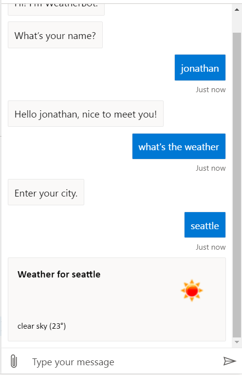
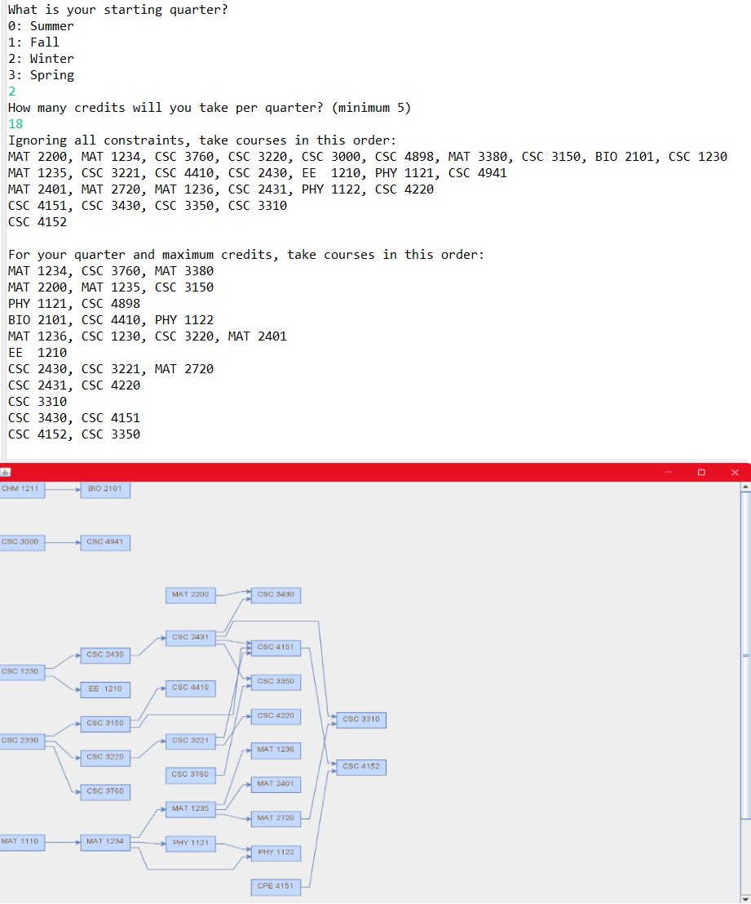
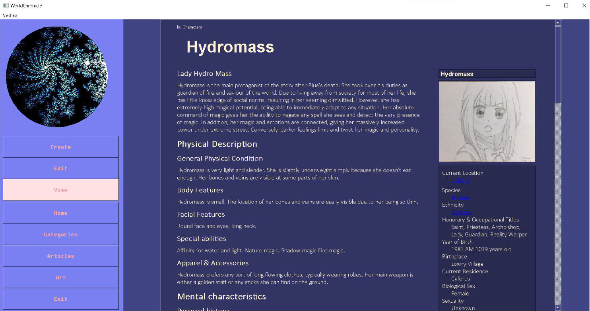
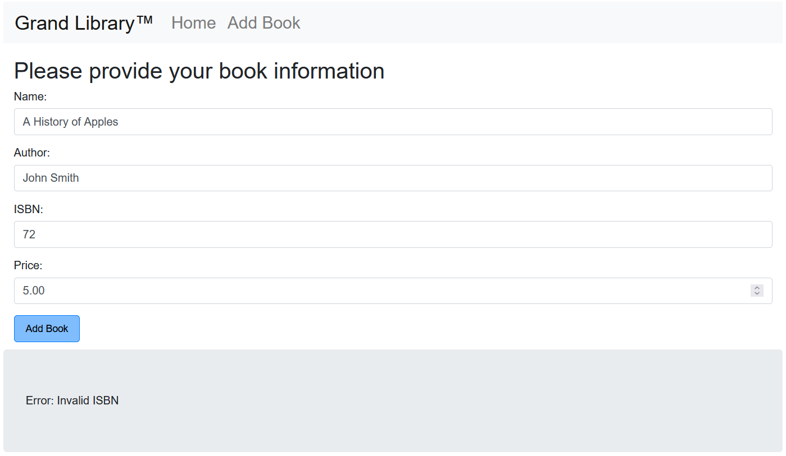
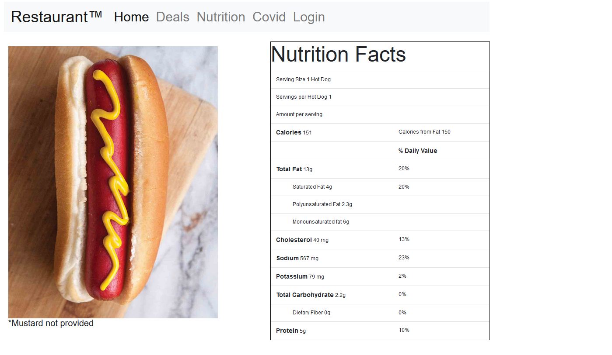

## Bachelor of Science in Computer Science
## Senior at Seattle Pacific University
### [View my LinkedIn Profile](https://www.linkedin.com/in/jonathanxu4/)
### [View my Github Profile](https://github.com/JonathanXu4/jonathanxu4.github.io)
### [View my Resume](/resume.pdf)

 

# Portfolio

## Microsoft Certified: Azure AI Engineer Associate

### Professionally certified in Azure AI Solutions with a general knowledge of all commonly used machine learning services such as computer vision, text synthesis, translation, search services, and more.
### - Proficient in Azure cognitive services and computer vision
### - Implemented conversational AI, natural language, and voice synthesis
### - Knowledge of Azure OpenAI and knowledge mining techniques

## Gourmacracy

### [View website](https://gourmacracy.onrender.com/)
### A full website restaurant ordering app featuring checkout, account creation and login, ordering, validation, and more.
### Implemented from scratch with a team of five graduating computer science majors over the course of a full year, starting from a 60-page system proposal document extensively detailing every possibility and feature.
### - Accessible user interface with navigation bar and account management
### - Secure database for menu management and credit-card processing
### - Fully operational shopping cart and purchase history
### Programmed using HTML, CSS, JavaScript, Node.js, bootstrap, express, and various other services
### Uses MongoDB and Render for website and database hosting

## Course Flow Diagram

### A program that constructs a course diagram out of a text file. The visualization will change depending on constraints such as starting quarter, number of credits per quarter, prerequisites for each class, and fulfilled prerequisites.
### Uses Java Runtime Environment 17.0.2, Maven, JGraphT, JGraphX, JFrame

## [World Chronicle](https://github.com/JonathanXu4/World-Chronicle)

### A file organization, viewing, and creation app made for storing and manipulating rich text with a custom designed UI
### Programmed in Qt and C++
### [Grand Library Repository](https://github.com/JonathanXu4/front-api)

### A database capable of searching and storing any book by name, author, and ISBN
### Accesses a backend that stores book titles and related book information
### Allows users to add books to the database and search for them
### Programmed in HTML, CSS, and JavaScript
### Uses MongoDB and Heroku for website and database hosting
### [Restaurant Repository](https://github.com/JonathanXu4/restaurant)

### A fake restaurant with a login page, nutrition facts, navigation, and various other information
### Programmed in HTML, CSS, and JavaScript
### Hosted using Heroku
